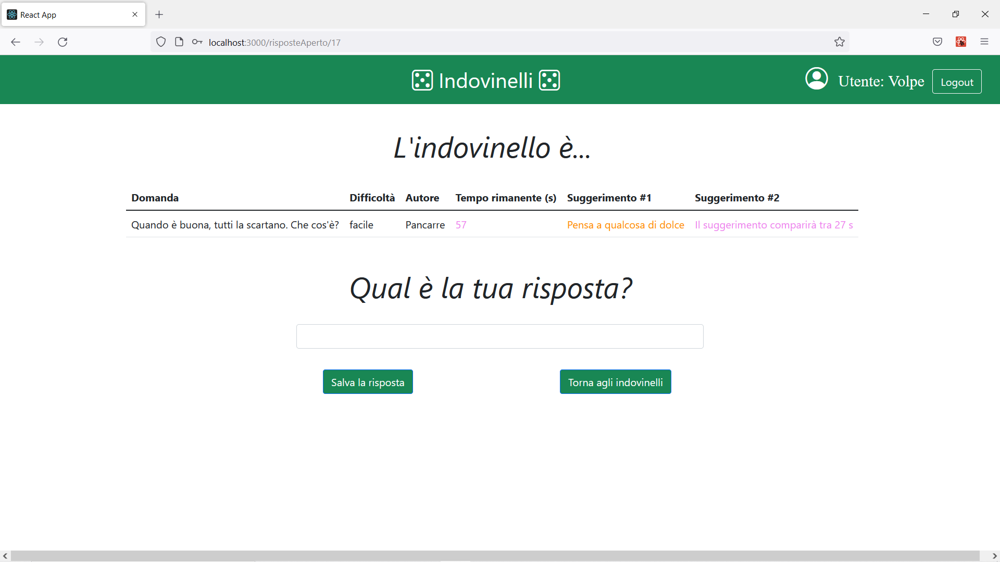

# Exam #2: "Indovinelli"
## Student: s303357 MALLEMACI SALVATORE 

## React Client Application Routes
- Route `/login`: pagina iniziale, permette ad un utente di effettuare il login (tramite email e password) oppure di eseguire l'accesso come navigatore anonimo;
- Route `/`: pagina principale, a cui si accede una volta loggati, dove l'utente può vedere la classifica, gestire i propri indovinelli e interagire con gli indovinelli in gioco creati dagli altri utenti;
- Route `/guest`: pagina a cui si accede accedendo come navigatore anonimo, dove la visibilità è limitata alla classifica e alla lista di indovinelli, senza la possibilità di interagirci;
- Route `/add`: pagina a cui si viene reindirizzati cliccando il bottone "Crea Indovinello" presente nella pagina principale, in cui è presente il form di creazione di un indovinello;
- Route `/risposteChiuso/:idIndovinello`: pagina in cui viene visualizzato un indovinello in gioco in stato "chiuso", con tutte le risposte che sono state date, la risposta corretta decisa dall'autore dell'indovinello e l'indicazione del vincitore se presente; 
- Route `/risposteAperto/:idIndovinello`: pagina in cui viene visualizzato un indovinello in gioco in stato "aperto", con un form di risposta qualora l'utente non abbia già fornito una risposta all'indovinello in questione e un conto alla rovescia che mostra il tempo rimanente;
- Route `/rispostePersonaliChiuso/:idIndovinello`: pagina in cui viene visualizzato un proprio indovinello in stato "chiuso", in cui l'autore può visualizzare tutte le risposte che sono state date, la risposta corretta da lui decisa al momento della creazione e l'indicazione del vincitore se presente;
- Route `/rispostePersonaliAperto/:idIndovinello`: pagina in cui viene visualizzato un proprio indovinello in stato "aperto", in cui l'autore può visualizzare tutte le risposte correnti (aggiornate al secondo) e un conto alla rovescia che mostra il tempo rimanente;
- Route `*`: pagina a cui si viene reindirizzati se l'URL inserito non soddisfa le precedenti route. Permette all'utente di tornare alla Route `/login`.

## API Server

- GET `/api/top3`
  - request parameters: None
  - response body content: Un array di oggetti, ognuno rappresentante una posizione in classifica, con relativi partecipanti e punteggio
  ```
  [{"posizione":1,"nickname":"Volpe","punteggio":6},{"posizione":2,"nickname":"Mike_pa, Eraclito","punteggio":2},{"posizione":3,"nickname":"JohnEx, Mark93","punteggio":1}]
  ```
- GET `/api/indovinelliAnonimo`
  - request parameters : None
  - response body content : Un array di oggetti, ognuno rappresentante un indovinello, con visibilità ridotta (limitata a domanda, difficoltà, stato)
  ```
  [{"domanda":"Senza testa sono più alto, con la testa sono più basso. Chi sono?","difficoltà":"difficile","stato":"aperto"}, {"domanda":"Cos’è che puoi prendere ma non gettare?","difficoltà":"difficile","stato":"chiuso"}, ...]
  ```
- GET `/api/indovinelli/:idAutore`
  - request parameters: idAutore (id dell'utente loggato)
  - response body content : Un array di oggetti, ognuno rappresentante un indovinello creato dall'utente loggato, con visibilità totale
  ```
  [{"id":3,"domanda":"Ha tre occhi e non è un mostro. Cos’è?","difficoltà":"medio","tempo":200,"risposta":"Il semaforo","sugg1":"Gli occhi sono colori","sugg2":"Pensa a quando guidi","stato":"aperto","idAutore":1,"nicknameAutore":"JohnEx","tempoInizio":null}, {"id":2,"domanda":"Che cosa si muove senza lasciare la minima traccia?","difficoltà":"medio","tempo":200,"risposta":"L'ombra","sugg1":"Serve la luce per vederla","sugg2":"Ti accompagna sempre","stato":"chiuso","idAutore":1,"nicknameAutore":"JohnEx","tempoInizio":"2022-07-12T16:16:19.000Z"},...]
  ```
- GET `/api/indovinelliInGioco/:idAutore`
  - request parameters: idAutore (id dell'utente loggato)
  - response body content: Un array di oggetti, ognuno rappresentante un indovinello in gioco a cui l'utente loggato può rispondere(se in stato "aperto", *risposta* non sarà definito) o visualizzare risposte, soluzioni e eventuale vincitore (se in stato "chiuso", *risposta* sarà definito)
  ```
  [{"id":11,"domanda":"Più è nera, più è pulita","difficoltà":"facile","tempo":120,"stato":"aperto","idAutore":4,"nicknameAutore":"Mike_pa","tempoInizio":null,"sugg1":"Può emettere un suono fastidioso","sugg2":"Ci si scrive con il gessetto"},{"id":16,"domanda":"Cos’è che puoi prendere ma non gettare?","difficoltà":"difficile","tempo":200,"stato":"chiuso","idAutore":6,"nicknameAutore":"Pancarre","tempoInizio":"2022-07-12T16:15:09.000Z","risposta":"Il raffreddore","sugg1":"Attenzione al freddo","sugg2":"Pensa a un malanno stagionale"}...]
  ```
- GET `/api/indovinello/:idIndovinello`
  - request parameters: idIndovinello (id dell'indovinello)
  - response body content: Un oggetto, rappresentante il singolo indovinello
  ```
  {"id":3,"domanda":"Ha tre occhi e non è un mostro. Cos’è?","difficoltà":"medio","tempo":200,"risposta":"Il semaforo","sugg1":"Gli occhi sono colori","sugg2":"Pensa a quando guidi","stato":"aperto","idAutore":1,"nicknameAutore":"JohnEx","tempoInizio":null}
  ```
- GET `/api/risposte`
  - request parameters : None 
  - response body content: Un array di oggetti, ognuno rappresentanti una risposta fornita da un utente
  ```
  [{"id":1,"risposta":"Il portiere","idAutore":1,"idIndovinello":12,"nickname":"JohnEx","punteggio":1},{"id":2,"risposta":"L'aria","idAutore":1,"idIndovinello":9,"nickname":"JohnEx","punteggio":0},{"id":3,"risposta":"La lettera T","idAutore":2,"idIndovinello":9,"nickname":"Mark93","punteggio":1},...]
  ```
- POST `/api/indovinelli`
  - request parameters: None
  - request body content: Un oggetto, contenente tutte le informazioni che definiscono un indovinello, creato da un utente loggato
  ```
  {"domanda":"Ha tre occhi e non è un mostro. Cos’è?","difficoltà":"medio","tempo":"200","risposta":"Il semaforo","sugg1":"Gli occhi sono colori","sugg2":"Pensa a quando guidi","stato":"aperto","idAutore":1,"nicknameAutore":"JohnEx","tempoInizio":null}
  ```
  - response body content: None 
- POST `/api/rispostaIndovinello`
  - request parameters: None
  - request body content: Un oggetto, contenente tutte le informazioni che definiscono una risposta da parte di un utente loggato
  ```
  {"risposta":"Il freddo","idAutore":1,"idIndovinello":8,"nicknameAutore":"JohnEx"}
  ```
  - response content: Il punteggio, ossia 0 (risposta errata), 1 (risposta corretta, facile), 2 (risposta corretta, medio), 3 (risposta corretta, difficile), "errore" (errore)
- PUT `/api/indovinello/:idIndovinello`
  - request parameters: idIndovinello (id dell'indovinello)
  - request body content: None
  - response body content : None

- PUT `/api/indovinellotempoInizio/:idIndovinello`
  - request parameters: idIndovinello (id dell'indovinello)
  - request body content: Un oggetto, contenente l'istanza di tempo del conto alla rovescia, in formato dayjs().format(0)
  ```
  {"tempoInizio":"2022-07-13T14:36:07.000Z"}
  ```
  - response body content : None

## Database Tables

- Table `USERS` - contiene **id**, email, name, hash, salt, score
- Table `RIDDLE` - contiene **id**, question, difficulty, time, answer, hint1, hint2, state, author, nicknameAuthor, startTime
- table `ANSWER` - contiene **id**, answer, idAuthor, idRiddle, nickname, score

## Main React Components
- `PageLayout` (in `PageLayout`): Ha lo scopo di mostrare la lista dei propri indovinelli e la lista degli indovinelli in gioco, divisa a sua volta in "aperti" e "chiusi";
- `AnswerForm` (in `AnswerForm.js`): Ha lo scopo di permettere all'utente di visualizzare l'indovinello a cui si sta cercando di rispondere, l'eventuale form di risposta qualora non abbia già fornito la propria soluzione, un conto alla rovescia con il tempo a disposizione;
- `RiddleForm` (in `RiddleForm.js`): Ha lo scopo di permettere all'utente l'inserimento dei dati necessari alla creazione e sottomissione di un nuovo indovinello; 
- `PersonalAnswer` (in `PersonalAnswer.js`): Ha lo scopo di mostrare all'utente l'evoluzione di un proprio indovinello, vedendo in tempo reale (con un aggiornamento al secondo) tutte le risposte da parte degli altri utenti e il conto alla rovescia;
- `Ranking` (in `Ranking.js`): Ha lo scopo di mostrare la classifica degli utenti, in particolare una top3 a pari-merito;
- `LoginForm` (in `LoginComponents.js`): Ha lo scopo di permettere l'inserimento di dati per autenticarsi, oppure scegliere di continuare come "navigatore anonimo", avendo così visibilità e funzionalità molto ridotte.

## Screenshot



## Users Credentials

| email | password |
|-------|----------|
| u1@p.it | password |
| u2@p.it | password |
| u3@p.it	| password |
| u4@p.it	| password |
| u5@p.it	| password |
| u6@p.it	| password |